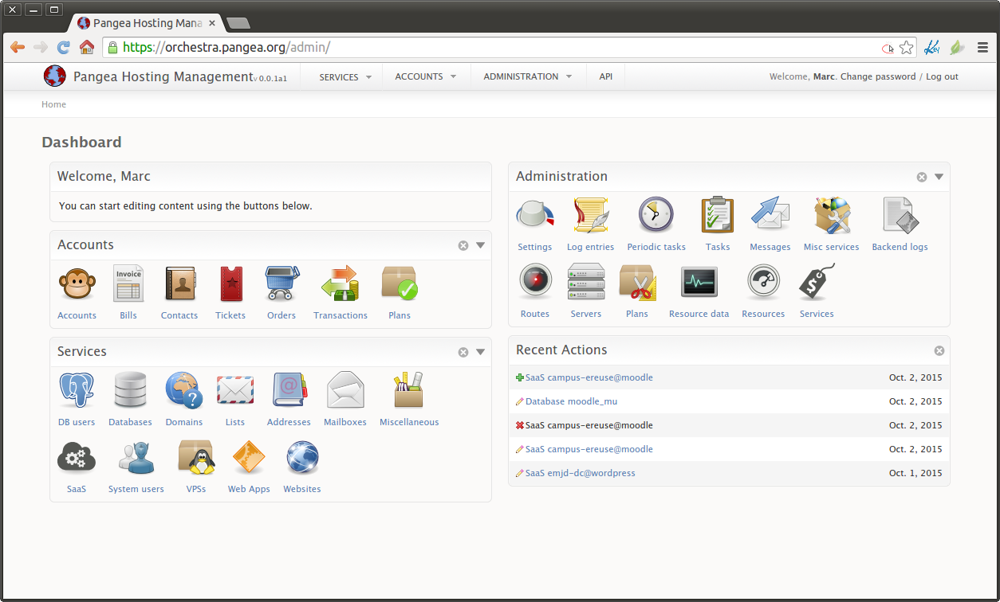

  **This project is in early development stage**

Django Orchestra
================

Orchestra is a Django-based framework for building web hosting control panels.

* [Documentation](http://django-orchestra.readthedocs.org/)
* [Install and upgrade](INSTALL.md)
* [Roadmap](ROADMAP.md)


Motivation
----------
There are a lot of widely used open source hosting control panels, however, none of them seems apropiate when you already have an existing service infrastructure or simply you want your services to run on a particular architecture.

The goal of this project is to provide the tools for easily build a fully featured control panel that is not tied to any particular service architecture.


Overview
--------

Django-orchestra is mostly a bunch of [plugable applications](orchestra/apps) providing common functionalities, like service management, resource monitoring or billing.

The admin interface relies on [Django Admin](https://docs.djangoproject.com/en/dev/ref/contrib/admin/), but enhaced with [Django Admin Tools](https://bitbucket.org/izi/django-admin-tools) and [Django Fluent Dashboard](https://github.com/edoburu/django-fluent-dashboard). [Django REST Framework](http://www.django-rest-framework.org/) is used for the REST API, with it you can build your client-side custom user interface.

Every app is [reusable](https://docs.djangoproject.com/en/dev/intro/reusable-apps/), this means that you can add any Orchestra application into your Django project `INSTALLED_APPS` strigh away.
However, Orchestra also provides glue, tools and patterns that you may find very convinient to use. Checkout the [documentation](http://django-orchestra.readthedocs.org/) if you want to know more.




Development and Testing Setup
-----------------------------
If you are planing to do some development or perhaps just checking out this project, you may want to consider doing it under the following setup

1. Create a basic [LXC](http://linuxcontainers.org/) container, start it and get inside.
    ```bash
    wget -O /tmp/create.sh \
           https://raw2.github.com/glic3rinu/django-orchestra/master/scripts/container/create.sh
    sudo bash /tmp/create.sh
    sudo lxc-start -n orchestra
    ```

2. Deploy Django-orchestra development environment inside the container
    ```bash
    wget -O /tmp/deploy.sh \
           https://raw2.github.com/glic3rinu/django-orchestra/master/scripts/container/deploy.sh
    cd /tmp/ # Moving away from /root before running deploy.sh
    bash /tmp/deploy.sh
    ```
    Django-orchestra source code should be now under `~orchestra/django-orchestra` and an Orchestra instance called _panel_ under `~orchestra/panel`


3. Nginx should be serving on port 80, but Django's development server can be used as well:
    ```bash
    su - orchestra
    cd panel
    python manage.py runserver 0.0.0.0:8888
    ```

4. A convenient practice can be mounting `~orchestra` on your host machine so you can code with your favourite IDE, sshfs can be used for that
    ```bash
    # On your host
    mkdir ~<user>/orchestra
    sshfs orchestra@<container-ip>: ~<user>/orchestra
    ```

5. To upgrade to current master just
    ```bash
    cd ~orchestra/django-orchestra/
    git pull origin master
    sudo ~orchestra/django-orchestra/scripts/container/deploy.sh
    ```


License
-------
Copyright (C) 2013 Marc Aymerich

This program is free software: you can redistribute it and/or modify
it under the terms of the GNU General Public License as published by
the Free Software Foundation, either version 3 of the License, or
(at your option) any later version.

This program is distributed in the hope that it will be useful,
but WITHOUT ANY WARRANTY; without even the implied warranty of
MERCHANTABILITY or FITNESS FOR A PARTICULAR PURPOSE.  See the
GNU General Public License for more details.

You should have received a copy of the GNU General Public License
along with this program. If not, see <http://www.gnu.org/licenses/>.
Status API Training Shop Blog About
